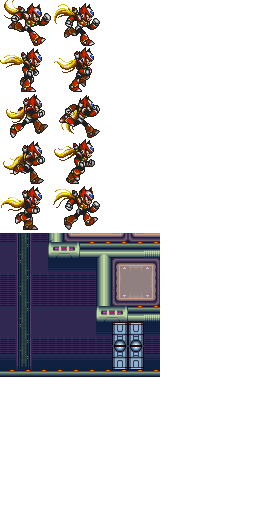

# OpenGL 2D Engine

Some sloppy code hastily put together to try to achieve an effect I have in mind for a game. An experiment in learning both the C language and OpenGL.

The idea is to take low resolution 2D game art, and scale it up to fit the larger screen, while adding some higher resolution
effects on top.

[A video of the included Demo](https://vimeo.com/40435006)

A mock up of the initial concept:

Result so far:

